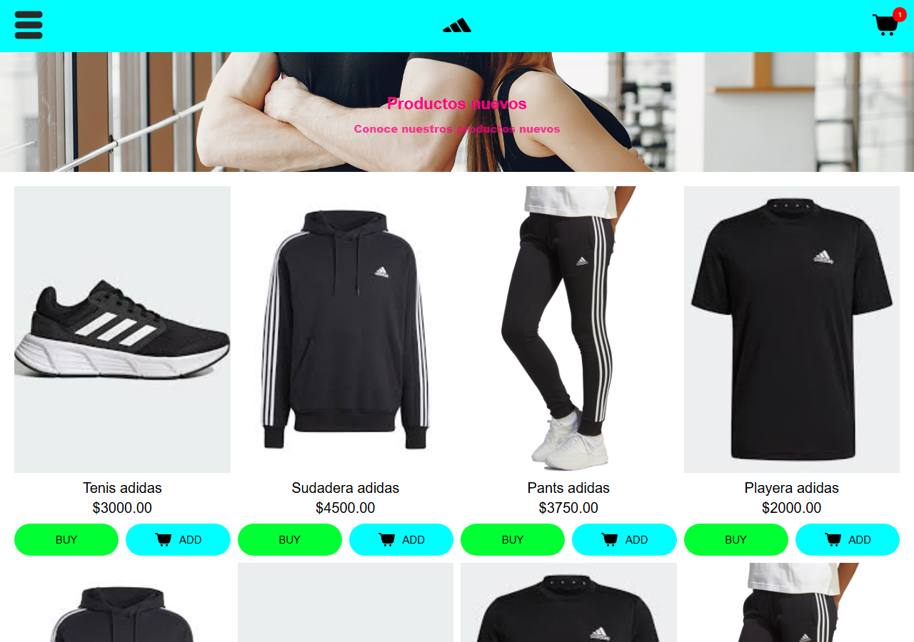
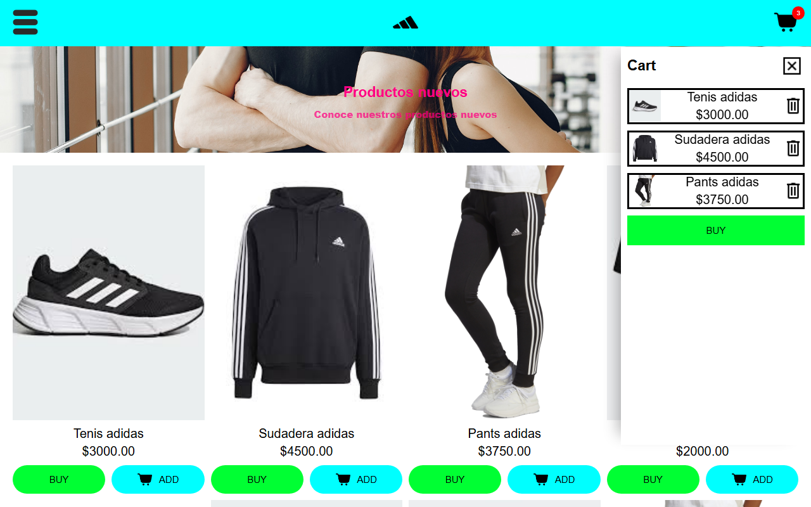
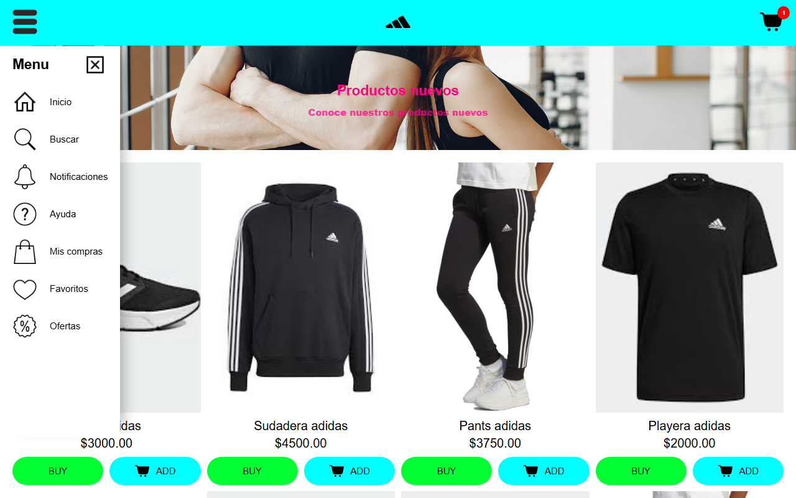
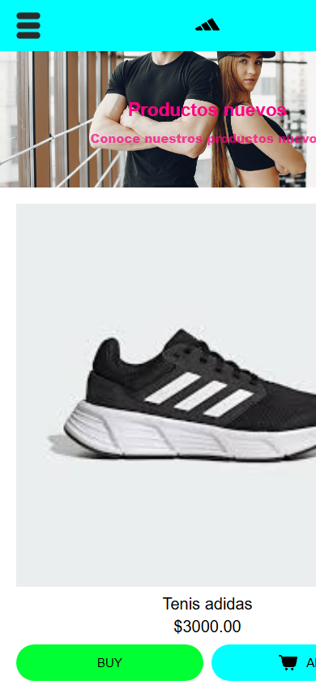

# E-commerce Adidas


Tienda en línea inspirada en Adidas, construida con **HTML**, **SCSS** y **JavaScript** puro. Incluye un catálogo de productos, un carrito lateral funcional con contador y un menú de navegación deslizable, todo con diseño responsivo.

## Capturas de pantalla

| Catálogo | Carrito |
| --- | --- |
|  |  |

| Menú lateral | Vista móvil |
| --- | --- |
|  |  |

## Funcionalidades

- **Catálogo** de productos en una cuadrícula responsiva con imagen, nombre, precio y botones *BUY* y *ADD*.
- **Carrito lateral**: el botón *ADD* agrega el producto (imagen, nombre y precio) al carrito.
- **Contador** sobre el ícono del carrito que se actualiza al agregar o eliminar productos y se oculta cuando llega a cero.
- **Eliminar productos** del carrito con el ícono de papelera.
- **Menú lateral** con accesos a Inicio, Buscar, Notificaciones, Ayuda, Mis compras, Favoritos y Ofertas.
- Menú y carrito se excluyen entre sí: al abrir uno se cierra el otro.
- Posición y altura de los paneles recalculadas en función de la altura real del encabezado.
- Transiciones suaves al abrir y cerrar paneles.

## Tecnologías utilizadas

| Tecnología | Uso |
| --- | --- |
| HTML5 | Estructura con `header`, `nav`, `main`, `section` y `article` |
| SCSS | Parciales por sección y mixins de breakpoints (500px, 1024px y 1025px) |
| JavaScript (ES6+) | Manipulación del DOM, eventos y estado del carrito |
| Google Fonts | Tipografía *Open Sans* |

## Estructura del proyecto

```text
E-comerce/
├── index.html
├── js/functions.js       # Lógica del carrito, contador y menú
├── CSS/
│   ├── main.scss         # Importa los parciales
│   ├── _base.scss        # Reset y mixins responsivos
│   ├── _header.scss
│   ├── _banner.scss
│   ├── _products.scss
│   ├── _cart.scss
│   ├── _menu.scss
│   └── main.css          # CSS compilado
└── img/                  # Íconos y fotos de productos
```

## Instalación y uso

No requiere dependencias.

```bash
git clone https://github.com/Donaldo500/E-comerce.git
cd E-comerce
```

Abre `index.html` en el navegador (o usa *Live Server* en VS Code).

Para editar los estilos:

```bash
npx sass CSS/main.scss CSS/main.css --watch
```

## Ejemplos de uso

1. Presiona **ADD** en cualquier producto: se agrega al carrito y el contador aumenta.
2. Abre el carrito con el ícono de la esquina superior derecha.
3. Elimina un producto con el ícono de papelera: el contador disminuye.
4. Abre el menú con el ícono de la esquina superior izquierda y ciérralo con la **X**.

Agregar un producto nuevo al catálogo solo requiere copiar un bloque `article.product` en `index.html`; el JavaScript le asigna automáticamente el comportamiento del botón *ADD*:

```html
<article class="product">
    
    <div class="info">
        <p>Nuevo producto</p>
        <p>$1500.00</p>
    </div>
    <div>
        <button class="buy"><p>BUY</p></button>
        <button class="add_cart"><p>ADD</p></button>
    </div>
</article>
```

## Contribuciones

Proyecto individual con fines de aprendizaje. Las sugerencias son bienvenidas mediante issues o pull requests.

## Aviso

Proyecto educativo sin fines comerciales. La marca Adidas y las imágenes de productos pertenecen a sus respectivos propietarios.

## Autor

**Donaldo Ibarra** - [@Donaldo500](https://github.com/Donaldo500)
